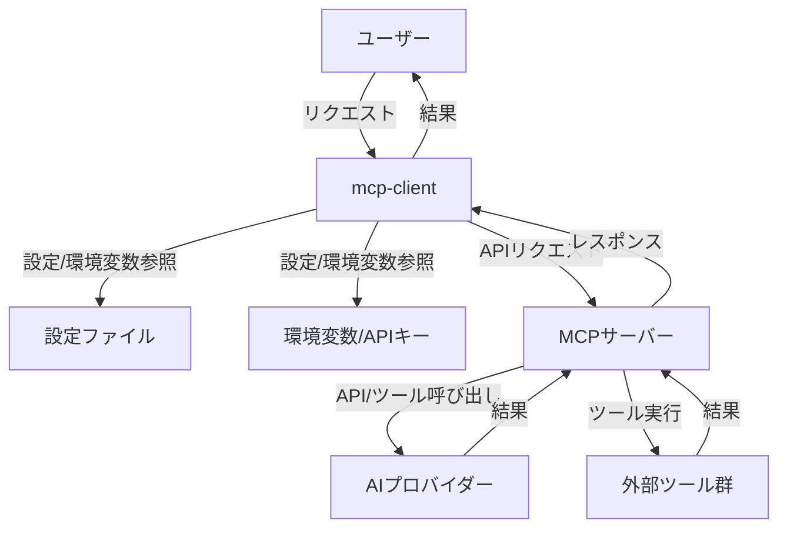

# ARCHITECTURE.md

## 概要

本ドキュメントは `mcp-client` プロジェクトのアーキテクチャ概要を説明します。

---

## 全体構成

`mcp-client` は、Model Context Protocol (MCP) に準拠したクライアント実装です。複数のAIプロバイダーやツールと連携し、MCPサーバーとの通信・ツール管理を行います。

### 主なディレクトリ・ファイル構成

- `src/` : メインのソースコード
  - `index.ts` : エントリーポイント
  - `mcp-client-manager.ts` : MCPクライアント・ツールの管理ロジック
  - `types.ts` : 型定義
  - `util.ts` : ユーティリティ関数
  - `provider/` : 各AIプロバイダー連携（例: `anthropic.ts`, `openai.ts`）
  - `tool/` : ツール実装
- `schema/` : スキーマ定義
- `config.js` : 設定ファイル

---

## 主要コンポーネント

### 1. MCPクライアントマネージャ
- 複数のMCPサーバー設定を受け取り、各サーバーへのクライアント接続・管理を行います。
- サーバーごとに利用可能なツールを取得し、ツール名とクライアントのマッピングを保持します。
- 例: `initializeToolsAndClients` 関数

### 2. ツール管理
- 各MCPサーバーから取得したツール情報を集約し、クライアント経由で実行できるようにします。
- ツール名の重複時は警告を出し、上書き管理します。

### 3. プロバイダー連携
- `provider/` ディレクトリ内で、AnthropicやOpenAIなど各AIプロバイダーとの連携ロジックを実装します。
- APIキーやエンドポイントは環境変数で管理します。

### 4. ユーティリティ・型定義
- 共通処理や型定義は `util.ts` や `types.ts` にまとめています。

---

## 設定・拡張性

- サーバーやツールの追加は `config.js` で設定可能。
- 新しいプロバイダーやツールは `provider/` や `tool/` にファイルを追加し、型・管理ロジックに追記することで拡張できます。

---

## データフロー概要

1. 設定ファイルからMCPサーバー情報を読み込む
2. 各サーバーへクライアント接続
3. サーバーごとに利用可能なツール一覧を取得
4. ユーザーのリクエストに応じて該当ツールを呼び出し、結果を返却

---

## 注意事項

- GitHub連携には `GITHUB_PERSONAL_ACCESS_TOKEN` などの環境変数が必要です。
- ツール名の重複時は警告が出ますが、最後に登録されたものが有効となります。

---

## 今後の拡張例

- 新規AIプロバイダーの追加
- ツールの自動検出・登録機能
- 設定ファイルの動的リロード

---

## システム構成図

---

ご質問・ご提案は [CONTRIBUTING.md](./CONTRIBUTING.md) もご参照ください。
